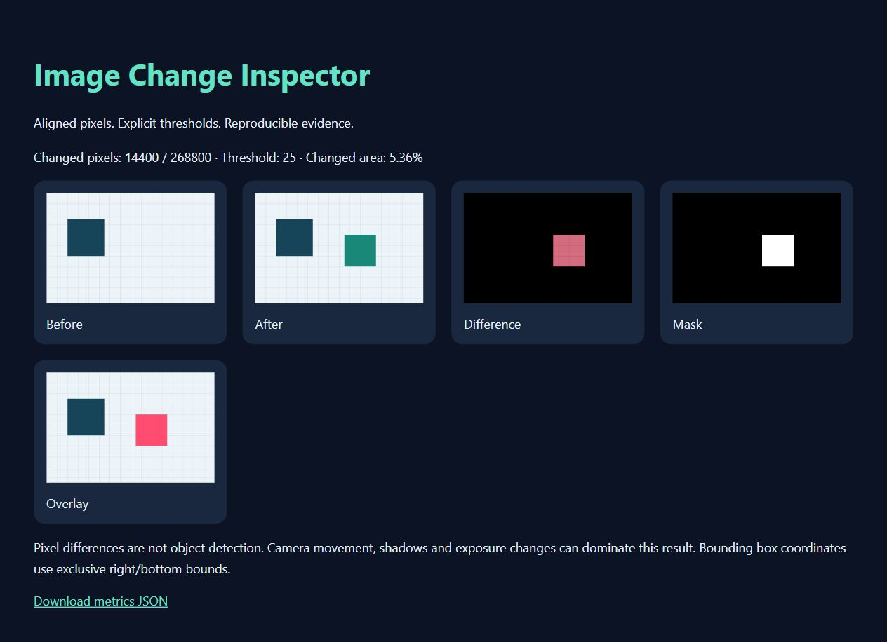
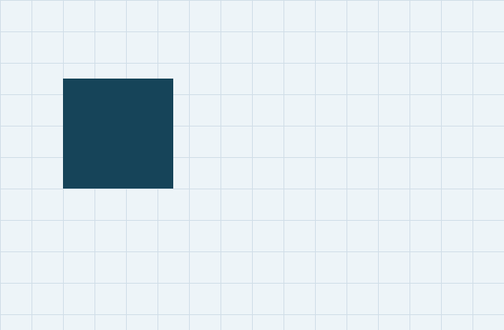
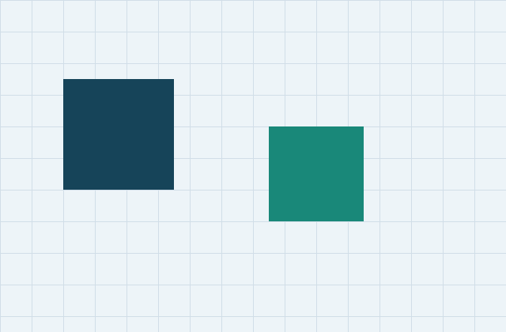
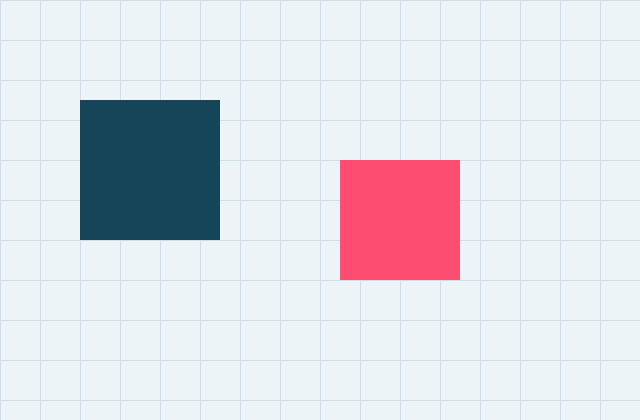

# Image Change Inspector



Local Python computer-vision learning tool for inspecting changes between two **already aligned**, equal-sized images. Produces a responsive offline HTML report, raw difference image, binary mask, overlay and reproducible JSON metrics. No uploads, cloud services or model downloads.

## Status and evidence

Implemented October 5, 2026; six unit tests passed with Python and Pillow 12.3.0. Synthetic demo executed successfully. This is an AI-assisted learning demonstration, not original robotics research or a production perception system.

## Visual examples

These are actual algorithm outputs from original synthetic grid fixtures, not photographs, device screenshots or benchmark results.





Open the bundled `index.html` for the complete five-panel report, or run the demo to regenerate `demo-output/report/index.html`.

## Setup and run

Python 3.10+; install the pinned dependency in a virtual environment:

```sh
python -m venv .venv
# Windows: .venv\Scripts\activate
# macOS/Linux: source .venv/bin/activate
python -m pip install -r requirements.txt
python -m unittest -v
python demo.py
python inspect_change.py before.png after.png --threshold 25 --output inspection-report
```

The output directory must not already exist. The demo similarly refuses to overwrite its directory; choose a new working directory for a second demonstration. Open the HTML locally; a server is optional. Input images remain untouched. A failed CLI inspection returns exit code 2 with a sanitized message, not private absolute file paths.

## Algorithm and metrics

EXIF orientation is normalized, opaque single-frame images converted to RGB, then absolute channel differences computed. A pixel changes if its **maximum RGB channel difference is strictly greater than** the configured 0–255 threshold. Mean absolute RGB difference averages all channels and pixels. Changed fraction is changed pixels divided by total pixels. Bounding-box right and bottom coordinates are exclusive; no changed pixels yields null.

RGB magnitude is not luminance, perceptual similarity or a semantic confidence score. Input size is limited to four million pixels per image. Transparent and multi-frame files are rejected. No implicit resizing or registration is performed. The pink overlay replaces changed pixels; it does not indicate objects or danger.

## Architecture and workflows

- `inspect_change.py`: validated loading, pure comparison, staged report export, CLI.
- `test_inspector.py`: identity, exact threshold boundary, bounding box/fraction, dimensions, threshold bounds, transparency, report writing and overwrite/input preservation checks.
- `demo.py`: original deterministic synthetic fixtures and report generation.
- `requirements.txt`: dependency pin.

Inspect aligned pairs, adjust a threshold using a fresh output path, compare masks and read JSON. Artifacts are staged before the completed directory is exposed. A file-system race or permission failure reports an error; exports are not a database transaction or resumable job.

## Limitations and robot-perception learning

Camera movement, lighting, shadows, compression and exposure can produce differences unrelated to object motion. No optical flow, tracking, object detection, camera calibration, pose estimation, robotics control or safety assessment is implemented. Future work could compare explicit registration and illumination compensation on licensed datasets with reproducible evaluation. No performance or accuracy benchmark is claimed.

## Sources and provenance

The pixel-difference API was checked against [official Pillow ImageChops documentation](https://pillow.readthedocs.io/en/stable/reference/ImageChops.html). Original synthetic fixtures and code, AI-assisted, by Sadia Liaqat's portfolio workflow. MIT license applies to this project's code and original fixtures; Pillow has its own license. No external dataset or pretrained weights.
